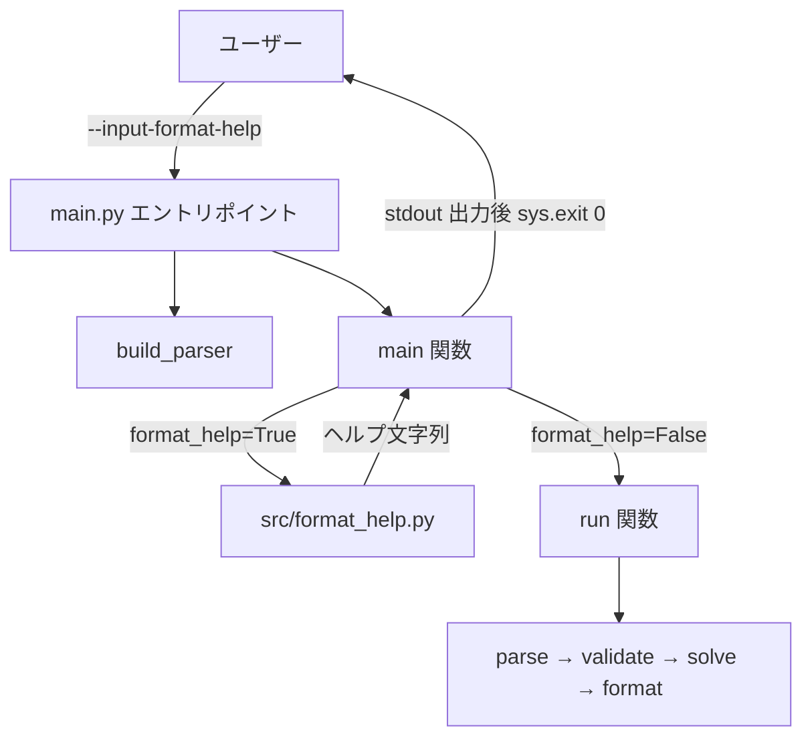
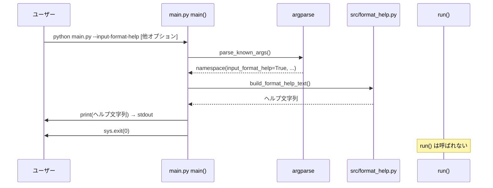

# 技術設計書: input-format-help

## 概要

本フィーチャーは、Water Sort Puzzle Solver CLI に `--input-format-help` オプションを追加し、`--input` 引数に渡す入力ファイルの対応フォーマット仕様（YAML・JSON・テキスト）と共通制約を標準出力に表示する機能を提供する。

**目的**: CLIユーザーが入力ファイルを正しく作成できるよう、フォーマット仕様と記述例を単一コマンドで参照できるようにする。

**対象ユーザー**: ウォーターソートパズルの解法を求めるエンドユーザー。

**影響**: 既存の `main.py`・`src/models.py` を最小限に修正し、新モジュール `src/format_help.py` を追加する。解析・探索パイプラインへの影響はない。

### ゴール

- `--input-format-help` オプションの追加（終了コード 0 で終了）
- YAML・JSON・テキスト各フォーマットの構造説明・記述例の表示
- 全フォーマット共通制約（ボトル本数・容量・拡張子判定）の表示
- `--input` 未指定時・他オプション同時指定時のヘルプ優先動作

### 非ゴール

- インタラクティブなフォーマット選択 UI
- ヘルプテキストの国際化（i18n）
- 入力ファイルの自動生成機能

---

## 要件トレーサビリティ

| 要件 | サマリー | コンポーネント | インターフェイス | フロー |
|------|---------|--------------|---------------|--------|
| 1.1 | 全フォーマット表示・終了コード 0 | FormatHelpRenderer, main | `build_format_help_text()`, `--input-format-help` | ヘルプ出力フロー |
| 1.2 | `--input` 未指定でも動作 | main | `build_parser()` の `required=False` 変更 | ヘルプ出力フロー |
| 1.3 | `--help` への記載 | main | `add_argument` の `help` 文字列 | — |
| 1.4 | 他オプション同時指定時もヘルプ優先 | main | `main()` 内早期終了ロジック | ヘルプ出力フロー |
| 2.1 | YAML `bottles` キーがリスト型 | FormatHelpRenderer | `build_format_help_text()` 戻り値 | — |
| 2.2 | YAML 空ボトル `null` / `[]` 記法 | FormatHelpRenderer | `build_format_help_text()` 戻り値 | — |
| 2.3 | YAML 最小構成サンプル（4本以上） | FormatHelpRenderer | `build_format_help_text()` 戻り値 | — |
| 2.4 | YAML 拡張子記載 | FormatHelpRenderer | `build_format_help_text()` 戻り値 | — |
| 3.1 | JSON トップレベル構造 | FormatHelpRenderer | `build_format_help_text()` 戻り値 | — |
| 3.2 | JSON 空ボトル `[]` 記法 | FormatHelpRenderer | `build_format_help_text()` 戻り値 | — |
| 3.3 | JSON 最小構成サンプル（4本以上） | FormatHelpRenderer | `build_format_help_text()` 戻り値 | — |
| 3.4 | JSON 拡張子記載 | FormatHelpRenderer | `build_format_help_text()` 戻り値 | — |
| 4.1 | テキスト 1行=1ボトル ルール | FormatHelpRenderer | `build_format_help_text()` 戻り値 | — |
| 4.2 | テキスト `(empty)` キーワード | FormatHelpRenderer | `build_format_help_text()` 戻り値 | — |
| 4.3 | テキスト最小構成サンプル（4本以上） | FormatHelpRenderer | `build_format_help_text()` 戻り値 | — |
| 4.4 | テキスト空行無視の記載 | FormatHelpRenderer | `build_format_help_text()` 戻り値 | — |
| 5.1 | ボトル本数範囲（4〜20） | FormatHelpRenderer | `build_format_help_text()` 戻り値 | — |
| 5.2 | 非空ボトル統一容量ルール | FormatHelpRenderer | `build_format_help_text()` 戻り値 | — |
| 5.3 | 色名が任意文字列 | FormatHelpRenderer | `build_format_help_text()` 戻り値 | — |
| 5.4 | 拡張子によるフォーマット自動検出の説明 | FormatHelpRenderer | `build_format_help_text()` 戻り値 | — |

---

## アーキテクチャ

### 既存アーキテクチャの分析

現在のアーキテクチャはパイプライン型 CLI（`parse → validate → solve → format → output`）であり、`main.py` がオーケストレートする。主な統合制約は以下のとおり：

- `--input` は現在 `required=True`。`--input-format-help` との共存のため `required=False` へ変更し手動バリデーションに切り替える（詳細は `research.md` 参照）
- `run()` 関数の変更は不要。フォーマットヘルプは `main()` 内で早期終了する
- `src/models.py` の依存ツリーは `models.py` がルート。`format_help.py` は `models.py` に依存しない末端モジュールとして追加する

### アーキテクチャパターン & バウンダリーマップ



**アーキテクチャ統合**:
- 採用パターン: 早期終了ガード（Early-Exit Guard）— `main()` 内でフラグを確認し、パイプライン呼び出し前に分岐
- 既存パターンの維持: パイプライン型フロー、`CLIArgs` 型付きラッパー、モジュール分割原則
- 新コンポーネントの根拠: `src/format_help.py` はヘルプテキスト生成責務を単一化するために必要
- Steering 準拠: `structure.md` の「各機能は独立モジュール」原則に従う

### テクノロジースタック

| レイヤー | 選択 / バージョン | フィーチャーでの役割 | 備考 |
|---------|----------------|-------------------|------|
| CLI | Python `argparse`（標準ライブラリ） | `--input-format-help` オプション登録 | 新規依存なし |
| ロジック | Python 3.12+ | `build_format_help_text()` でヘルプ文字列生成 | 型アノテーション必須 |
| ランタイム | CPython 3.12 / uv | 既存環境そのまま | 変更なし |

---

## システムフロー



---

## コンポーネントとインターフェイス

### コンポーネントサマリー

| コンポーネント | ドメイン / レイヤー | 意図 | 要件カバレッジ | 主な依存 | コントラクト |
|-------------|----------------|------|-------------|---------|------------|
| FormatHelpRenderer | ロジック（src/） | フォーマットヘルプ文字列の生成 | 1.1, 2.1–2.4, 3.1–3.4, 4.1–4.4, 5.1–5.4 | なし（P0） | Service |
| main.py（修正） | CLI エントリポイント | 引数解析・早期終了ガード | 1.1–1.4 | FormatHelpRenderer (P0), run() (P0) | Service |
| CLIArgs（修正） | モデル（src/models.py） | `format_help` フラグの型付き保持 | 1.2, 1.4 | なし | State |

---

### ロジック層

#### FormatHelpRenderer

| フィールド | 詳細 |
|----------|------|
| 意図 | 全フォーマット（YAML・JSON・テキスト）の仕様説明・サンプル・共通制約を含む文字列を生成する |
| 要件 | 1.1, 2.1, 2.2, 2.3, 2.4, 3.1, 3.2, 3.3, 3.4, 4.1, 4.2, 4.3, 4.4, 5.1, 5.2, 5.3, 5.4 |

**責務と制約**:
- YAML・JSON・テキスト各セクションの構造説明・記述例・拡張子情報を含む文字列を返す
- 共通制約セクション（ボトル本数・容量・色名・拡張子自動検出ルール）を含む
- `sys.stdout` への書き込みは行わない（呼び出し側に委譲）
- 外部依存なし。`src/models.py` にも依存しない

**依存**:
- なし

**コントラクト**: Service [x]

##### サービスインターフェイス

```python
def build_format_help_text() -> str:
    """全フォーマットのヘルプ文字列を返す。副作用なし。"""
```

- 事前条件: なし
- 事後条件: 非空文字列を返す。YAML・JSON・テキスト・共通制約の各セクションを含む
- 不変条件: ボトル本数範囲は 4〜20、サンプルは 4本以上を含む

**実装ノート**:
- 統合: `main.py` から `from src.format_help import build_format_help_text` でインポートする
- バリデーション: 戻り値は純粋な文字列生成のみ。入力値バリデーション不要
- リスク: サンプルテキストの内容が実際の parser の仕様と乖離するリスクあり。実装時は `src/parser.py` の空ボトル表現と一致させること

---

### CLIエントリポイント層

#### main.py（修正箇所）

| フィールド | 詳細 |
|----------|------|
| 意図 | `--input-format-help` フラグを追加し、フラグが真の場合にヘルプ出力して早期終了する |
| 要件 | 1.1, 1.2, 1.3, 1.4 |

**責務と制約**:
- `build_parser()` に `--input-format-help` 引数を追加する
- `--input` を `required=False` に変更し、`main()` 内で手動バリデーションを行う
- `main()` 内で `namespace.input_format_help` が真の場合、`build_format_help_text()` を呼び出して `print` し、`sys.exit(0)` する
- フォーマットヘルプ出力後は解析・探索処理を実行しない

**依存**:
- Outbound: `src/format_help.FormatHelpRenderer` — ヘルプ文字列生成 (P0)
- Outbound: `src/models.CLIArgs` — `format_help` フィールド追加後の型付きラッパー (P0)

**コントラクト**: Service [x]

##### サービスインターフェイス（修正部分）

```python
def build_parser() -> argparse.ArgumentParser:
    # 追加: --input-format-help
    # 変更: --input の required=False

def main() -> None:
    # 追加: format_help フラグの早期終了ガード
```

**実装ノート**:
- `--input` の `required=False` 変更後、`main()` 内で以下の手動チェックを追加する:
  ```
  if not namespace.input_format_help and namespace.input is None:
      parser.error("--input は必須です（--input-format-help なし時）")
  ```
- `CLIArgs` の `input_path` は `format_help=True` 時に `""` または `None` になり得るが、`run()` は呼ばれないため問題なし
- リスク: `--input` 必須変更により既存の argparse エラーメッセージが変わる。`--help` の説明文で補足すること

---

## データモデル

### CLIArgs 修正

`src/models.py` の `CLIArgs` dataclass に以下のフィールドを追加する：

```python
@dataclass
class CLIArgs:
    input_path: str
    validate_only: bool = False
    strategy: Strategy = "bfs"
    timeout: float = 30.0
    output_format: OutputFormat = "text"
    output_path: str | None = None
    verbose: bool = False
    debug: bool = False
    format_help: bool = False  # 追加
```

- `format_help=True` の場合、`input_path` は使用されない
- 型安全性: `bool` 型で明示的に制約

---

## エラーハンドリング

### エラー戦略

`--input-format-help` フロー内ではユーザーエラーは発生しない（引数なしで動作する設計のため）。

### エラーカテゴリと対応

**ユーザーエラー（既存フローへの影響）**:
- `--input` 未指定かつ `--input-format-help` も未指定の場合: `parser.error()` で `stderr` に出力、終了コード 2
- 上記以外の既存エラーパターンは変更なし

**モニタリング**: 新たなログ・エラートラッキングは不要

---

## テスト戦略

### ユニットテスト

`tests/test_format_help.py` を新規作成：

1. `build_format_help_text()` が非空文字列を返すこと
2. YAML セクション: `bottles`・`null`/`[]`・サンプル 4本以上・`.yaml`/`.yml` を含むこと
3. JSON セクション: `{"bottles": [...]}`・`[]`・サンプル 4本以上・`.json` を含むこと
4. テキストセクション: 1行=1ボトル・`(empty)`・サンプル 4本以上・空行無視の記載を含むこと
5. 共通制約セクション: ボトル本数 4〜20・統一容量ルール・色名任意・拡張子自動検出を含むこと

### 統合テスト

`tests/test_main.py` を新規作成：

1. `--input-format-help` 単独指定で終了コード 0、stdout に出力があること
2. `--input-format-help --input puzzle.yaml` 同時指定でヘルプのみ出力・終了コード 0
3. `--input-format-help --strategy dfs` 同時指定でヘルプのみ出力・終了コード 0
4. `--input` 未指定（`--input-format-help` なし）でエラー終了（終了コード 2）

---

## 参考資料

詳細な調査ログおよびアーキテクチャ選択の根拠は `.kiro/specs/input-format-help/research.md` を参照。
