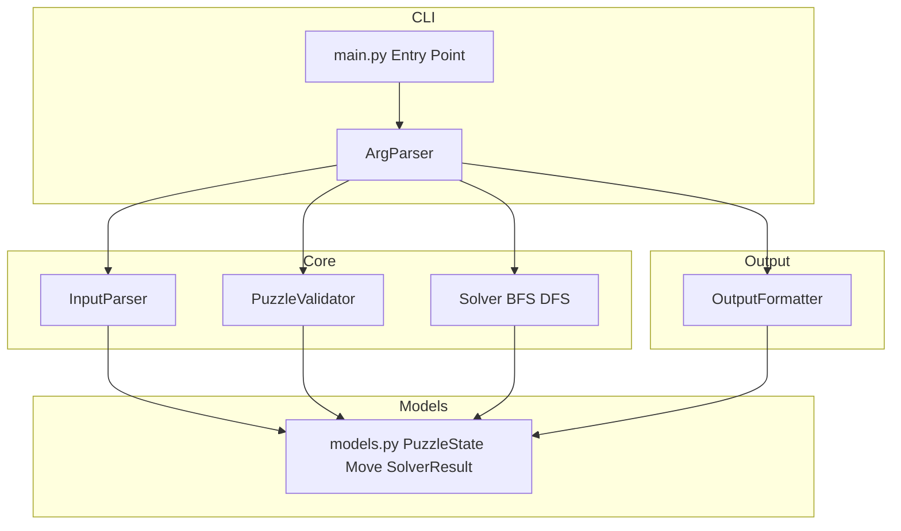
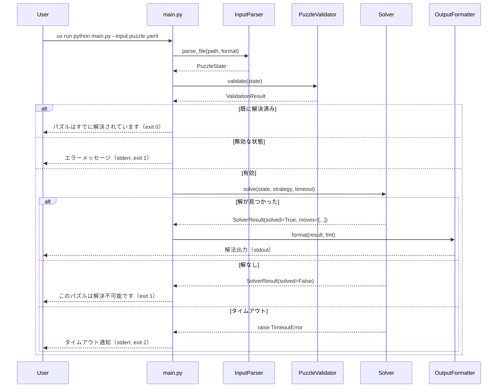
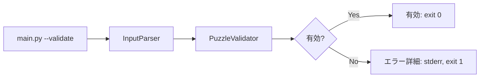
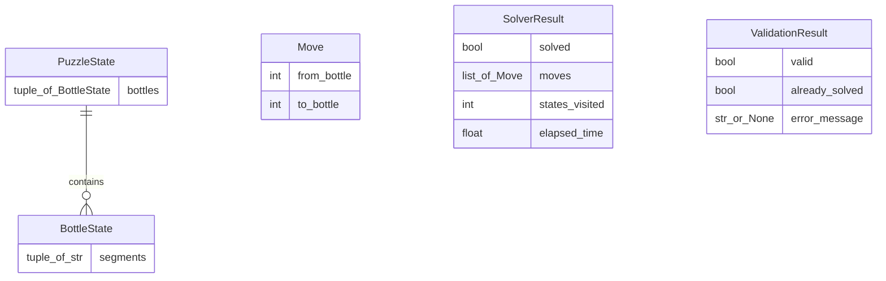
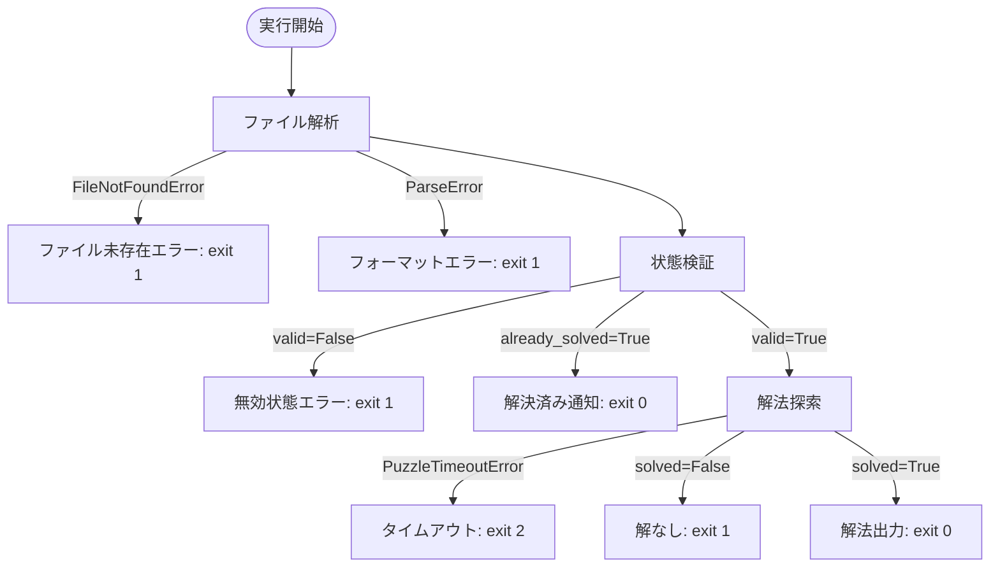

# 技術設計書：Water Sort Solver CLI

## Overview

Water Sort Solver CLI は、ウォーターソートパズルの初期状態をファイルから読み込み、BFS または DFS による状態空間探索で解法手順を自動生成する Python 製コマンドラインツールである。Python 3.12 の型ヒントを活用し、標準ライブラリ中心（依存は `pyyaml` のみ）の構成で、保守性・テスト容易性を確保する。

対象ユーザーはウォーターソートパズルのプレイヤーであり、ゲームの初期状態をテキストファイルで記述して実行するだけで解法ステップを取得できる。既存のコードベースはほぼ空（`main.py` のプレースホルダーのみ）であり、本設計はグリーンフィールド実装として定義する。

### Goals

- YAML・JSON・テキスト形式の入力ファイルを解析し、ボトル配列を読み込む
- パズル状態の妥当性検証（色セグメント数の整合、解決済み判定）を提供する
- BFS（デフォルト、最短手数保証）と DFS（高速探索）の両アルゴリズムで解を探索する
- 解法を `text`・`json`・`yaml` 形式で標準出力またはファイルに出力する
- `uv run python main.py [オプション]` で直接実行できる直感的な CLI を提供する

### Non-Goals

- GUI・Web インターフェース
- A*・遺伝的アルゴリズム等の高度な探索アルゴリズム（将来拡張）
- Windows の `signal.alarm` ベースのタイムアウト（ポーリング方式で代替）
- ネットワーク通信・クラウドストレージ連携
- パズル画像認識・OCR 入力

---

## Architecture

### Architecture Pattern & Boundary Map

レイヤードアーキテクチャを採用する。CLI 層 → 解析層 → 検証層 → ソルバ層 → 出力層の一方向データフローにより、各コンポーネントを独立してテスト可能とする。



**Architecture Integration**:
- 採用パターン: レイヤードアーキテクチャ（CLI → Core → Output の一方向依存）
- 責務境界: 各モジュールは単一責務を持ち、モデル定義（`models.py`）を中心に共有する
- 新規コンポーネントの根拠: 単体テストと将来的なアルゴリズム追加を見越した分離。詳細は `research.md` の「レイヤードアーキテクチャの採用」決定を参照。

### Technology Stack

| レイヤー | 選択 / バージョン | 本フィーチャーでの役割 | 備考 |
|---------|-----------------|----------------------|------|
| CLI | `argparse`（標準ライブラリ） | オプション解析、ヘルプ生成 | 依存追加なし。click/typer との比較は `research.md` を参照 |
| 入力解析 | `json`（標準ライブラリ）、`pyyaml` 6.x | JSON/YAML/テキスト形式のパース | `pyyaml` が唯一の外部依存 |
| ソルバ | `collections.deque`（標準ライブラリ） | BFS キューの実装 | DFS は再帰または `list` スタックで実装 |
| 出力 | `json`、`pyyaml`（再利用）、`sys.stdout` | text/json/yaml フォーマット出力 | |
| ランタイム | Python 3.12+ | 型ヒント、`NamedTuple`、`match-case` | `pyproject.toml` 記載済み |

---

## System Flows

### メインフロー（解法探索）



### --validate のみのフロー



---

## Requirements Traceability

| 要件 | サマリ | コンポーネント | インターフェース | フロー |
|------|--------|--------------|----------------|--------|
| 1.1 | `--input` オプションでファイル受け取り | ArgParser | `CLIArgs.input_path` | メインフロー |
| 1.2 | 指定ファイルの読み込みと解析 | InputParser | `parse_file()` | メインフロー |
| 1.3 | YAML/JSON/テキスト形式対応 | InputParser | `parse_file(format)` | メインフロー |
| 1.4 | ボトル数・容量の認識 | InputParser, PuzzleValidator | `parse_file()` → `(PuzzleState, int)`, `validate(state, bottle_capacity)` | メインフロー |
| 1.5 | 4〜20 本・4 セグメント対応 | PuzzleValidator | `validate()` | メインフロー |
| 2.1 | 色セグメント数の整合検証 | PuzzleValidator | `validate()` | メインフロー |
| 2.2 | 不整合時エラー終了 | PuzzleValidator, Main | `ValidationResult` | メインフロー |
| 2.3 | ボトル 0 本・容量 0 の検証 | PuzzleValidator | `validate()` | メインフロー |
| 2.4 | 解決済みパズルの通知 | PuzzleValidator | `ValidationResult.already_solved` | メインフロー |
| 2.5 | `--validate` のみで検証結果を返す | ArgParser, Main | `CLIArgs.validate_only` | validate フロー |
| 3.1 | BFS/DFS による解探索 | Solver | `solve()` | メインフロー |
| 3.2 | 有効な移動手順の返却 | Solver | `SolverResult.moves` | メインフロー |
| 3.3 | `--strategy bfs\|dfs` 選択 | ArgParser, Solver | `CLIArgs.strategy`, `solve(strategy)` | メインフロー |
| 3.4 | `--timeout` でタイムアウト制御 | Solver | `solve(timeout)` | メインフロー |
| 3.5 | `--timeout 0` でタイムアウトなし | Solver | `solve(timeout=0)` | メインフロー |
| 3.6 | 解なし通知 | Solver, Main | `SolverResult.solved=False` | メインフロー |
| 3.7 | タイムアウト通知と終了 | Solver, Main | `TimeoutError` 例外 | メインフロー |
| 4.1 | 「ボトル X → ボトル Y」形式出力 | OutputFormatter | `format_text()` | メインフロー |
| 4.2 | 総手数サマリ表示 | OutputFormatter | `format()` | メインフロー |
| 4.3 | `--verbose` でステップ後状態のビジュアル表示 | OutputFormatter | `format_text(verbose=True)` | メインフロー |
| 4.4 | `--output` でファイル書き出し | Main, OutputFormatter | `CLIArgs.output_path` | メインフロー |
| 4.5 | `--format text\|json\|yaml` 選択 | ArgParser, OutputFormatter | `CLIArgs.output_format` | メインフロー |
| 5.1 | `--help` 表示 | ArgParser（argparse 自動生成） | — | — |
| 5.2 | `--version` 表示 | ArgParser | `--version` action | — |
| 5.3 | 不明オプション時エラー+ヘルプ参照 | ArgParser | `parse_known_args()` | — |
| 5.4 | 終了コード 0/非ゼロ | Main | `sys.exit()` | 全フロー |
| 5.5 | `uv run python main.py` 形式実行 | main.py | `if __name__ == "__main__"` | — |
| 6.1 | ファイル未存在エラーメッセージ | InputParser | `FileNotFoundError` 処理 | メインフロー |
| 6.2 | フォーマット不正エラーメッセージ | InputParser | `ParseError` | メインフロー |
| 6.3 | エラーを stderr に出力 | Main | `sys.stderr` | 全フロー |
| 6.4 | `--debug` で探索進捗を stderr 出力 | Solver, Main | `CLIArgs.debug` | メインフロー |

---

## Components and Interfaces

### コンポーネント概要

| コンポーネント | ドメイン / レイヤー | 目的 | 要件カバレッジ | 主要依存（優先度） | コントラクト |
|-------------|-----------------|------|--------------|-----------------|------------|
| `main.py`（CLIEntryPoint） | CLI | 引数解析・オーケストレーション・終了コード制御 | 1.1, 2.5, 3.3–3.5, 4.4–4.5, 5.1–5.5, 6.3 | ArgParser(P0), InputParser(P0), PuzzleValidator(P0), Solver(P0), OutputFormatter(P0) | Service |
| `src/models.py` | Models | 共有型定義（PuzzleState, Move, SolverResult 等） | 全要件の基盤 | — | State |
| `src/parser.py`（InputParser） | Core / 入力 | ファイル読み込みとフォーマット別解析 | 1.1–1.4, 6.1–6.2 | pyyaml(P1), json stdlib(P0) | Service |
| `src/validator.py`（PuzzleValidator） | Core / 検証 | パズル状態の妥当性検証 | 1.4–1.5, 2.1–2.5 | models.py(P0) | Service |
| `src/solver.py`（Solver） | Core / 探索 | BFS/DFS 状態空間探索 | 3.1–3.7, 6.4 | models.py(P0), collections.deque(P0) | Service |
| `src/formatter.py`（OutputFormatter） | Output | 解法の text/json/yaml フォーマット出力 | 4.1–4.5 | models.py(P0), pyyaml(P1) | Service |

---

### Models

#### `src/models.py`

| フィールド | 詳細 |
|----------|------|
| Intent | 全コンポーネントで共有する型定義・定数を一元管理する |
| Requirements | 全要件の基盤 |

**Responsibilities & Constraints**
- `PuzzleState`、`Move`、`SolverResult`、`ValidationResult`、`CLIArgs`、エラー型の定義のみを行う
- ビジネスロジックを含まない純粋なデータ定義モジュール

**Contracts**: State [x]

##### State Management

```python
from __future__ import annotations
from typing import NamedTuple, Literal
from dataclasses import dataclass, field

# ボトル内のセグメントを下から上の順に格納する immutable タプル
BottleState = tuple[str, ...]
# パズル全体の状態（hashable で set に格納可能）
PuzzleState = tuple[BottleState, ...]

# 標準ボトル容量（要件 1.5: 容量 4 セグメント）
BOTTLE_CAPACITY: int = 4

class Move(NamedTuple):
    from_bottle: int  # 0-indexed
    to_bottle: int    # 0-indexed

class SolverResult(NamedTuple):
    solved: bool
    moves: list[Move]
    states_visited: int
    elapsed_time: float  # seconds

class ValidationResult(NamedTuple):
    valid: bool
    already_solved: bool
    error_message: str | None  # None if valid

Strategy = Literal["bfs", "dfs"]
OutputFormat = Literal["text", "json", "yaml"]

@dataclass
class CLIArgs:
    """argparse.Namespace の型付きラッパー（要件 1.1, 3.3–3.5, 4.4–4.5, 5.1–5.5）"""
    input_path: str                              # --input（必須）
    validate_only: bool = False                  # --validate
    strategy: Strategy = "bfs"                  # --strategy
    timeout: float = 30.0                        # --timeout（0 でタイムアウトなし）
    output_format: OutputFormat = "text"         # --format
    output_path: str | None = None               # --output
    verbose: bool = False                        # --verbose
    debug: bool = False                          # --debug

class ParseError(ValueError):
    """入力ファイルの解析エラー"""

class PuzzleTimeoutError(Exception):
    """解探索のタイムアウト"""

# --- 純粋状態変換関数（副作用なし、solver.py・formatter.py から共有） ---

def apply_move(state: PuzzleState, move: Move) -> PuzzleState:
    """
    ムーブを適用した新しい PuzzleState を返す。元の state は変更しない。
    Preconditions: move は get_legal_moves() で得た合法手であること
    Postconditions: 戻り値は move 適用後の immutable PuzzleState
    """
```

- **Persistence**: インメモリ（ファイル永続化なし）
- **Concurrency**: シングルスレッド（探索はメインスレッドで同期実行）
- **Note**: `apply_move()` は副作用のない純粋変換関数として `models.py` に定義し、`solver.py`（探索中の状態生成）と `formatter.py`（verbose モードの中間状態再生成）の両方から参照する。

---

### CLI

#### `main.py`（CLIEntryPoint）

| フィールド | 詳細 |
|----------|------|
| Intent | 引数解析・各コンポーネント呼び出し・終了コードの制御 |
| Requirements | 1.1, 2.5, 3.3–3.5, 4.4–4.5, 5.1–5.5, 6.3 |

**Responsibilities & Constraints**
- `argparse.ArgumentParser` を構築し、全オプションを定義する
- 各コンポーネント（InputParser → PuzzleValidator → Solver → OutputFormatter）を順序通りに呼び出す
- 全エラーは `sys.stderr` に出力し、`sys.exit()` で適切な終了コードを返す
- ビジネスロジックを持たない（各コンポーネントに委譲）

**Dependencies**
- Outbound: `InputParser` — ファイル解析 (P0)
- Outbound: `PuzzleValidator` — 状態検証 (P0)
- Outbound: `Solver` — 解法探索 (P0)
- Outbound: `OutputFormatter` — 結果出力 (P0)

**Contracts**: Service [x]

##### Service Interface

```python
def main() -> None:
    """CLI エントリポイント。argparse で引数を解析し、各コンポーネントを呼び出す。"""

def build_parser() -> argparse.ArgumentParser:
    """引数パーサを構築して返す。"""

def run(args: argparse.Namespace) -> int:
    """解析済み引数を受け取り、処理を実行して終了コードを返す。"""
```

**終了コード定義**:
| コード | 意味 |
|-------|------|
| 0 | 正常終了（解が見つかった、または検証成功） |
| 1 | エラー（ファイル未存在、不正フォーマット、解なし、不正入力） |
| 2 | タイムアウト |

- Preconditions: `sys.argv` が有効な形式で渡されていること
- Postconditions: 終了コードが上記定義に従って `sys.exit()` で設定されること

**Implementation Notes**
- Integration: `argparse` の `action="version"` で `--version` を実装し、`parse_known_args()` で不明オプションを検出
- Validation: `--timeout` は 0 以上の整数、`--strategy` は `bfs|dfs`、`--format` は `text|json|yaml` を `choices` で制約
- Risks: 将来的なサブコマンド追加時に `argparse.add_subparsers()` へリファクタリングが必要

---

### Core

#### `src/parser.py`（InputParser）

| フィールド | 詳細 |
|----------|------|
| Intent | 入力ファイルを読み込み、フォーマット別に解析して `PuzzleState` を返す |
| Requirements | 1.1–1.4, 6.1–6.2 |

**Responsibilities & Constraints**
- YAML / JSON / テキスト形式の自動検出（拡張子または `--format` 引数による）
- 解析失敗時は `ParseError` を raise し、エラー種別と期待フォーマットを message に含める
- ファイル未存在時は `FileNotFoundError` を raise する
- ボトル容量（セグメント数）はすべてのボトルで統一された値を返す

**Dependencies**
- External: `pyyaml` 6.x — YAML パース (P1)
- External: `json`（stdlib） — JSON パース (P0)

**Contracts**: Service [x]

##### Service Interface

```python
def parse_file(
    path: str,
    fmt: Literal["yaml", "json", "text", "auto"] = "auto",
) -> tuple[PuzzleState, int]:
    """
    指定パスのファイルを読み込み (PuzzleState, bottle_capacity) を返す。
    Preconditions: path は読み取り可能なファイルパスであること
    Postconditions: PuzzleState は tuple[tuple[str, ...], ...] 形式
                    bottle_capacity は全ボトルの最大セグメント数（空ボトルのみの場合は BOTTLE_CAPACITY）
                    全ボトルのセグメント数が一致しない場合は ParseError を raise
    Raises: FileNotFoundError, ParseError
    """
```

**入力フォーマット仕様**:

*YAML 例*:
```yaml
bottles:
  - [red, blue, green, red]
  - [blue, green, red, blue]
  - []
```

*JSON 例*:
```json
{"bottles": [["red","blue","green","red"], ["blue","green","red","blue"], []]}
```

*テキスト例*:
```
red blue green red
blue green red blue
(empty)
```

**Implementation Notes**
- Integration: 拡張子 `.yaml`/`.yml` → YAML、`.json` → JSON、その他 → テキスト形式として自動判定
- Validation: 各フォーマットで `ParseError` のメッセージに期待フォーマット例を含める
- Risks: `pyyaml` の `safe_load()` のみ使用し、任意コード実行を防止する

---

#### `src/validator.py`（PuzzleValidator）

| フィールド | 詳細 |
|----------|------|
| Intent | PuzzleState の妥当性を検証し `ValidationResult` を返す |
| Requirements | 1.4–1.5, 2.1–2.5 |

**Responsibilities & Constraints**
- 各色の合計セグメント数がボトル容量の倍数であることを検証（要件 2.1）
- ボトル数・容量ゼロ検証（要件 2.3）
- 解決済み判定（全ボトルが単色または空 → 要件 2.4）
- 標準パズルサイズ（4〜20 本、容量 4）の検証（要件 1.5）

**Dependencies**
- Inbound: `main.py` — 検証呼び出し (P0)

**Contracts**: Service [x]

##### Service Interface

```python
def validate(
    state: PuzzleState,
    bottle_capacity: int = BOTTLE_CAPACITY,
) -> ValidationResult:
    """
    PuzzleState を検証して ValidationResult を返す。
    Preconditions: state は parse_file() で生成されたタプル
                   bottle_capacity は parse_file() が返す検出容量（デフォルト: BOTTLE_CAPACITY=4）
    Postconditions: valid=True かつ already_solved=True の場合は解決済み通知
    Invariants: valid=False の場合 error_message は None でない
    """

def is_solved(state: PuzzleState) -> bool:
    """全ボトルが単色または空の場合 True を返す。"""
```

**Implementation Notes**
- Validation: 色ごとの出現回数を `collections.Counter` で集計し、`bottle_capacity` との整合を確認（各色の総セグメント数が `bottle_capacity` の倍数であること）
- Capacity 検出: `parse_file()` は全ボトルの最大セグメント数（`max(len(b) for b in state, default=BOTTLE_CAPACITY)`）を容量として `main.py` へ返し、`validate()` の `bottle_capacity` 引数に渡す。ボトル長が混在する場合はパーサが `ParseError` を raise する。
- Risks: 空ボトルの扱い（空タプル `()` を有効な状態として許容）

---

#### `src/solver.py`（Solver）

| フィールド | 詳細 |
|----------|------|
| Intent | BFS または DFS で PuzzleState の解法手順を探索する |
| Requirements | 3.1–3.7, 6.4 |

**Responsibilities & Constraints**
- BFS: `collections.deque` によるキューで最短手数解を保証
- DFS: `list` スタックで高速探索（最適性保証なし）
- タイムアウト: `time.perf_counter()` によるループ内ポーリング（詳細は `research.md` の「タイムアウト実装方式」を参照）
- `--debug` 時は訪問済み状態数と経過時間を `sys.stderr` に出力
- 合法手の生成規則: 注ぎ元の最上層色が注ぎ先の最上層色と一致 **かつ** 注ぎ先に空きがある

**Dependencies**
- External: `collections.deque`（stdlib） — BFS キュー (P0)
- External: `time`（stdlib） — タイムアウト計測 (P0)

**Contracts**: Service [x]

##### Service Interface

```python
def solve(
    initial_state: PuzzleState,
    strategy: Strategy = "bfs",
    timeout: float = 30.0,
    debug: bool = False,
) -> SolverResult:
    """
    初期状態から解法手順を探索して SolverResult を返す。
    Preconditions: initial_state は validate() で有効と確認済み
    Postconditions: solved=True の場合 moves を適用すると解決状態になる
    Raises: PuzzleTimeoutError（timeout > 0 かつ制限時間超過時）
    Invariants: timeout=0 の場合は制限なし
    """

def get_legal_moves(state: PuzzleState) -> list[Move]:
    """現在の状態から合法手の一覧を返す。"""

# apply_move() は models.py に定義。solver.py はそれを import して使用する。
```

**Implementation Notes**
- Integration: BFS では経路を `dict[PuzzleState, tuple[PuzzleState, Move]]`（親状態とムーブ）で管理し、解決状態から遡って手順を復元
- Validation: タイムアウトチェックは BFS/DFS ループの各イテレーション先頭で実施
- Risks: 大規模状態空間（20 ボトル）では BFS がメモリ超過する可能性あり。タイムアウトが保護として機能する。

---

### Output

#### `src/formatter.py`（OutputFormatter）

| フィールド | 詳細 |
|----------|------|
| Intent | SolverResult を指定フォーマットで文字列化し、stdout またはファイルに書き出す |
| Requirements | 4.1–4.5 |

**Responsibilities & Constraints**
- `text` 形式: 「ボトル X → ボトル Y」（1-indexed）+ 総手数サマリ
- `verbose` 時は各ステップ後のボトル状態をテキストアートで表示
- `json` / `yaml` 形式: 機械可読な構造化出力
- `--output` 指定時はファイルに書き出し、未指定時は `sys.stdout` に出力

**Dependencies**
- External: `pyyaml`（再利用） — YAML 出力 (P1)

**Contracts**: Service [x]

##### Service Interface

```python
def format_output(
    result: SolverResult,
    initial_state: PuzzleState,
    fmt: OutputFormat = "text",
    verbose: bool = False,
) -> str:
    """
    SolverResult を指定フォーマットの文字列に変換して返す。
    Preconditions: result.solved=True
    Postconditions: 戻り値は指定フォーマットの有効な文字列
    """

def write_output(content: str, output_path: str | None = None) -> None:
    """
    content を output_path（指定時）またはstdout に書き出す。
    Raises: OSError（ファイル書き込み失敗時）
    """
```

**text 形式の出力例**:
```
ステップ 1: ボトル 3 → ボトル 1
ステップ 2: ボトル 2 → ボトル 4
...
合計 12 手で解決しました。
```

**json 形式の出力例**:
```json
{
  "solved": true,
  "total_moves": 12,
  "moves": [{"from": 3, "to": 1}, {"from": 2, "to": 4}],
  "stats": {"states_visited": 1024, "elapsed_time": 0.42}
}
```

**Implementation Notes**
- Integration: `--verbose` の各ステップ表示は `models.apply_move()` を順次適用して中間状態を生成する（Output → Models の依存はレイヤー設計で許容済み。Output → Core の依存は生じない）
- Validation: `fmt` が `text|json|yaml` 以外の場合は `ValueError` を raise（argparse の `choices` で事前防止）
- Risks: 出力ファイルのパス不正時は `OSError` を捕捉して stderr に出力

---

## Data Models

### Domain Model

ウォーターソートパズルのドメインモデルは以下の概念で構成される：

- **PuzzleState**（集約ルート）: パズルの全体状態。ボトルのリストを immutable タプルで表現し、探索の `visited` 集合に直接格納可能。
- **BottleState**: 単一ボトルの状態。色文字列のタプル（下から上の順）。空ボトルは `()`.
- **Move**（値オブジェクト）: `from_bottle` / `to_bottle` のペア（0-indexed）。
- **SolverResult**（値オブジェクト）: 探索結果（手順リスト・統計情報）。

**不変条件**:
- 全ボトルのセグメント数は同一（容量 `BOTTLE_CAPACITY`、デフォルト 4）
- 各色のセグメント総数は `BOTTLE_CAPACITY` の倍数
- `PuzzleState` はイミュータブル（探索中に変更されない）

### Logical Data Model



**一貫性・整合性**:
- `PuzzleState` の変換は `apply_move()` を経由し、新しいインスタンスとして返す（イミュータビリティ保持）
- `SolverResult.moves` の各 `Move` を `apply_move()` で順次適用すると解決状態に到達することを保証

### Data Contracts & Integration

**入力ファイルスキーマ（YAML）**:
```yaml
bottles:
  - [color1, color2, color3, color4]  # 下から上の順
  - []                                 # 空ボトル
```

**出力 JSON スキーマ**:
```json
{
  "solved": true,
  "total_moves": 12,
  "moves": [{"from": 1, "to": 3}],
  "stats": {"states_visited": 1024, "elapsed_time": 0.42}
}
```

---

## Error Handling

### Error Strategy

すべてのエラーは `main.py` で一元的に捕捉し、適切な終了コードとともに `sys.stderr` へ出力する。

### Error Categories and Responses

**ユーザーエラー（終了コード 1）**:
- ファイル未存在 → `FileNotFoundError` → 「ファイルが見つかりません: {パス}」
- フォーマット不正 → `ParseError` → エラー種別 + 期待フォーマット例
- 不正なパズル状態 → `ValidationResult(valid=False)` → 具体的なエラー理由

**業務ロジックエラー（終了コード 1）**:
- 解なし → `SolverResult(solved=False)` → 「このパズルは解決不可能です」
- 解決済み → `ValidationResult(already_solved=True)` → 「パズルはすでに解決されています」（終了コード 0）

**タイムアウト（終了コード 2）**:
- `PuzzleTimeoutError` → 「探索がタイムアウトしました（{elapsed:.1f}秒）」+ 現時点の訪問済み状態数



### Monitoring

- `--debug` フラグ時: 探索ループ内で訪問済み状態数と経過時間を `sys.stderr` へ定期出力（1000 イテレーションごと）
- エラーメッセージはすべて `sys.stderr` に出力（要件 6.3）

---

## Testing Strategy

### Unit Tests

- `InputParser`: YAML/JSON/テキスト形式の正常パース・`FileNotFoundError`・`ParseError` の各ケース
- `PuzzleValidator`: 有効状態・無効状態（色不整合、ボトル 0 本）・解決済み判定
- `Solver.get_legal_moves()`: 合法手の正確な列挙（複数ケース）
- `Solver.apply_move()`: ムーブ適用後の状態の正確性と元状態の不変性
- `OutputFormatter`: text/json/yaml 各フォーマットの出力文字列検証

### Integration Tests

- 小規模パズル（4 ボトル）の BFS 解法エンドツーエンド（`main.run()` を直接呼び出し）
- DFS での解法探索と手数の確認
- `--validate` フラグのみでの検証フロー
- タイムアウトシナリオ（タイムアウト値 0.001 秒で不解可能パズルを実行）
- 各出力フォーマット（text/json/yaml）での正常終了確認

### Performance Tests

- 標準サイズ（12 ボトル × 4 セグメント）での BFS 解法が 30 秒以内に完了すること
- `--timeout 5` 指定時に 5 秒以内に `PuzzleTimeoutError` が発生すること

---

## Security Considerations

- YAML 解析には `yaml.safe_load()` のみを使用し、`yaml.load()` は禁止（任意コード実行防止）
- 入力ファイルのパスはユーザー指定のため、ディレクトリトラバーサル攻撃の心配は最小（ローカルツール）
- 出力ファイルへの書き込みは `--output` 明示指定時のみ実施

## Performance & Scalability

- BFS はメモリ消費が大きいため、デフォルト 30 秒タイムアウトが保護として機能する
- 標準的なゲームパズル（最大 20 ボトル × 4 セグメント）を対象とし、それ以上のスケーリングは対象外
- `PuzzleState` の `tuple` 表現により、`visited` 集合への O(1) アクセスを確保
